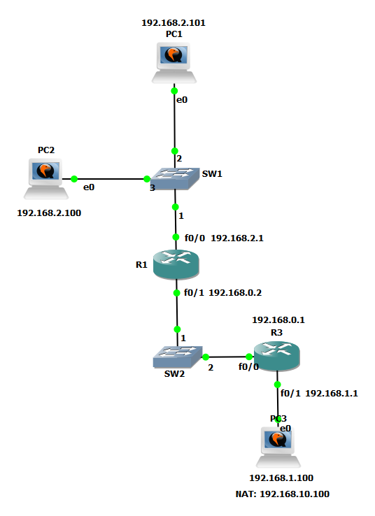
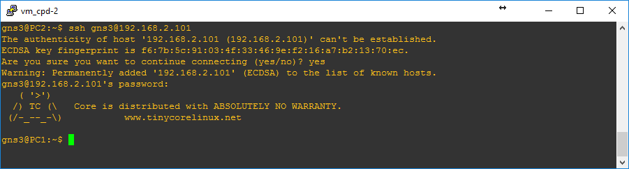

#Fundamentos de Redes e Protocolos - Trabalho Prático
## Cenário Prático


##Notas Iniciais
>Os 3 hosts ficaram com conectividade entre eles, no entanto, após aplicação da alinea d), em que foram bloqueados protocolos IP, deixou de ser possível verificar a conectividade por ICMP de e para o host PC3

## Configuração dos Hosts

### Instalação do SSH 
```bash
#Instalar SSH
tce-load -wi openssh
```

```bash
#Iniciar o serviço
sudo /usr/local/etc/init.d/openssh start
```

### PC1
```bash
#Adiciona configurações ao /opt/bootlocal.sh
echo "/usr/local/etc/init.d/openssh start" >> /opt/bootlocal.sh
echo "hostname PC1">> /opt/bootlocal.sh
echo "ifconfig eth0 192.168.2.101 netmask 255.255.255.0" >> /opt/bootlocal.sh
echo "route add default gw 192.168.2.1" >> /opt/bootlocal.sh

#Executa as configurações e guarda-as
sudo sh /opt/bootlocal.sh
sudo /usr/bin/filetool.sh -b
```

**Ping do PC1 para o PC2**


### PC2
```bash
#Adiciona configurações ao /opt/bootlocal.sh
echo "/usr/local/etc/init.d/openssh start">> /opt/bootlocal.sh
echo "hostname PC2">> /opt/bootlocal.sh
echo "ifconfig eth0 192.168.2.100 netmask 255.255.255.0" >> /opt/bootlocal.sh
echo "route add default gw 192.168.2.1" >> /opt/bootlocal.sh

#Bloquear acesso do PC1 ao ssh do PC2 - Após alinea d)
echo "iptables -I INPUT -s 192.168.2.101 -p tcp --dport ssh -j REJECT" >> /opt/bootlocal.sh

#Executa as configurações e guarda-as
sudo sh /opt/bootlocal.sh
sudo /usr/bin/filetool.sh -b
```

**Ping do PC2 para o PC1**


### PC3
```bash
#Adiciona configurações ao /opt/bootlocal.sh
echo "hostname PC3">> /opt/bootlocal.sh
echo "ifconfig eth0 192.168.1.100 netmask 255.255.255.0" >> /opt/bootlocal.sh
echo "route add default gw 192.168.1.1" >> /opt/bootlocal.sh

#Executa as configurações e guarda-as
sudo sh /opt/bootlocal.sh
sudo /usr/bin/filetool.sh -b
```


##Configuraçãos dos Routers
### Router 1
####Interface 0/0
```bash
#Configura a interface f0/0
interface FastEthernet 0/0
ip address 192.168.2.1 255.255.255.0
no shutdown
```

####Interface 0/1
```bash
#Configura a interface f0/1
interface FastEthernet 0/1
ip address 192.168.0.2 255.255.255.0
no shutdown
```

####Rota
```bash
#Configura rota estática para encaminhar para o Router 3 os pedido feitos rede à rede 192.168.1.0 
ip route 192.168.1.0 255.255.255.0 192.168.0.1

#Rota após configuração NAT - alinea C) 
ip route 192.168.10.0 255.255.255.0 192.168.0.1
```

**Guardar Configurações**
```bash
copy running-config startup-config
```


### Router 3
####Interface 0/0
```bash
#Configura a interface f0/0
interface FastEthernet 0/0
ip address 192.168.0.1 255.255.255.0
no shutdown
```

####Interface 0/1
```bash
#Configura a interface f0/1
interface FastEthernet 0/1
ip address 192.168.1.1 255.255.255.0
no shutdown
```

####Rota
```bash
#Configura rota estática para encaminhar para o Router 1 os pedido feitos rede à rede 192.168.2.0 
ip route 192.168.2.0 255.255.255.0 192.168.0.2
```

#### Configurar NAT
```bash
#Define interface f0/1 como "interna"
interface FastEthernet 0/1
ip nat inside

#Define interface f0/1 como "externa"
interface FastEthernet 0/0
ip nat outside

#adiciona entrada à NAT table
ip nat inside source static 192.168.1.100 192.168.10.100
```

#### Access List
```bash
#Criar uma Extended Access List
ip access-list extended ACL_EXT

# Nega qualquer entrada de protocolo IP
500 deny ip any any

# Permite entrada de pacote pela porta 22 (ssh)
10 permit tcp host 192.168.1.100 any eq 22

#associa a Access List criada à interface f0/1
int f0/1
ip access-group ACL_EXT in
```

**Guardar Configurações**
```bash
copy running-config startup-config
```


**Ping PC3 bloqueado**


**Acesso do PC3 ao hosts PC1 e PC2**


**Acesso do PC2 ao host PC1**


**Acesso do PC1 ao host PC2 Negado**


___
|  |  |
|--------|--------|
| **Realizado por:** | Jorge Martins (jorgemfm@gmail.com)     |
| **Disciplina:** |  Fundamentos de Redes e Protocolos|
| **Professor:** | Mário Antunes |
| **Data:** |  15-12-2016 |
